# E-commerce Compose

## Overview
ECommerceCompose is a user-centric Android application designed as a showcase for modern e-commerce solutions. Developed entirely in Kotlin using Jetpack Compose, the project follows clean architecture principles and leverages the MVVM design pattern to ensure a scalable and maintainable codebase.

This project serves as an example of how to integrate modern technologies and best practices into the Android development process. From the user interface to the data layer, every aspect of the application is optimized for high performance and ease of maintenance.

ECommerceCompose not only provides core e-commerce functionalities but also serves as a solid reference point for Android developers looking to learn and work with popular libraries such as Jetpack Compose, Room, Hilt, and Firebase. The project aims to offer a practical application while also being an educational resource for developers.

## Project Features
- **CLEAN ARCHITECTURE**
- **MVVM** 
- **MVI**
- **COMPOSE**
- **PREVIEW PARAMETER PROVIDER**
- **NAVIGATION**
- **BOTTOM-NAVIGATION** 
- **HILT** 
- **RETROFIT**
- **ROOM**
- **DETEKT**
- **FIREBASE AUTH - FIRESTORE**
- **COIL**
- **VERSION CATALOG**
- **COROUTINES FLOW**

  

## 📸 Screenshots

| 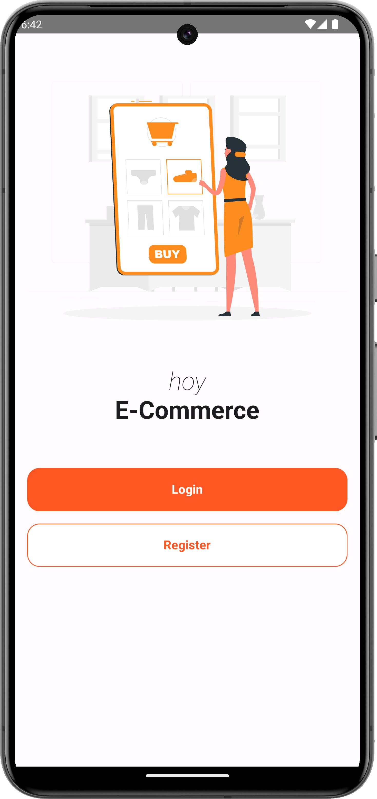          | 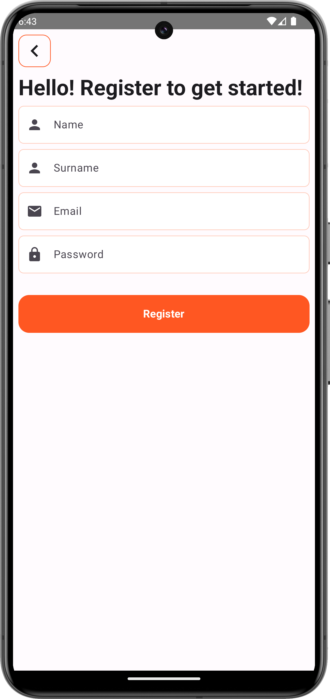         | 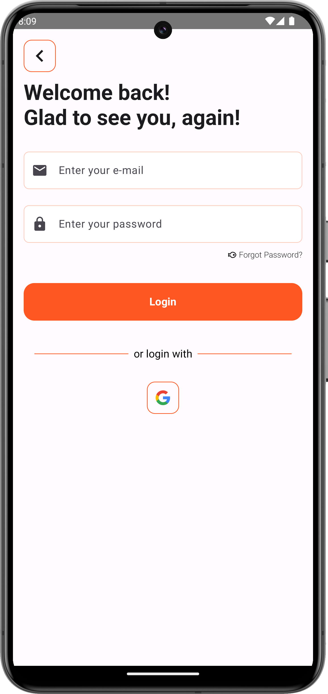           |
|:----------------------------------------------------------------------:|:----------------------------------------------------------------------:|:----------------------------------------------------------------------:|
|           **WELCOME PAGE**                                             |   **REGISTER PAGE**                                                    |    **LOGIN PAGE**                                                      |

| 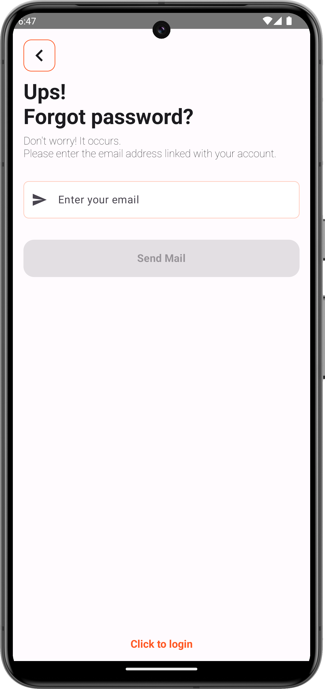  |         | 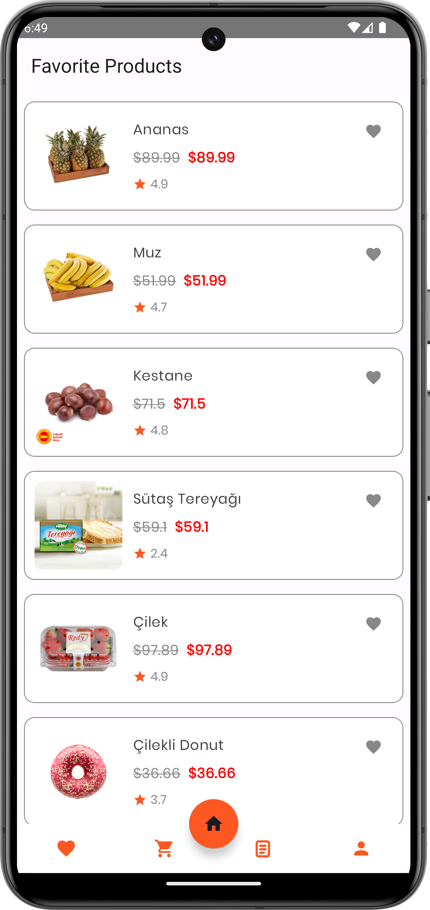         |
|:----------------------------------------------------------------------:|:----------------------------------------------------------------------:|:----------------------------------------------------------------------:|
|           **FORGOT PASSWORD PAGE**                                     |   **HOME PAGE**                                                        |    **FAVORITES PAGE**                                                  |

| 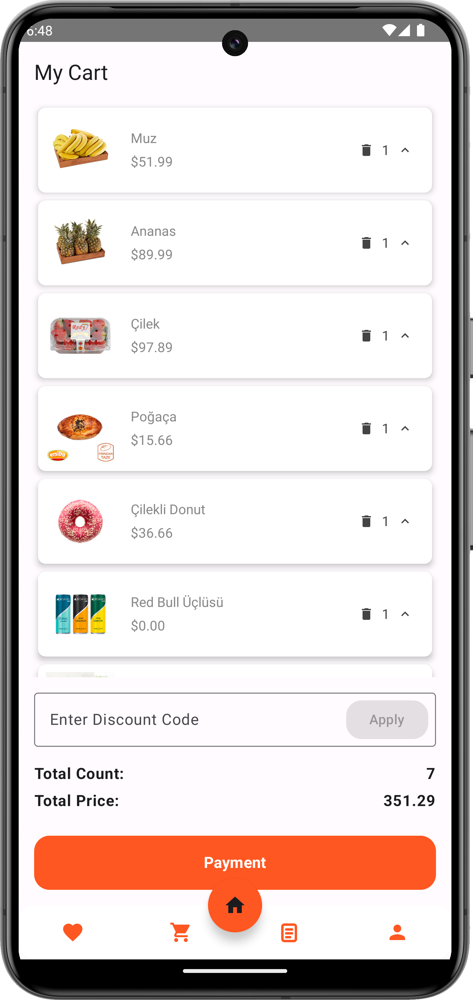             | 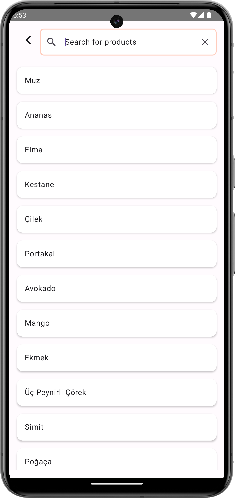           | 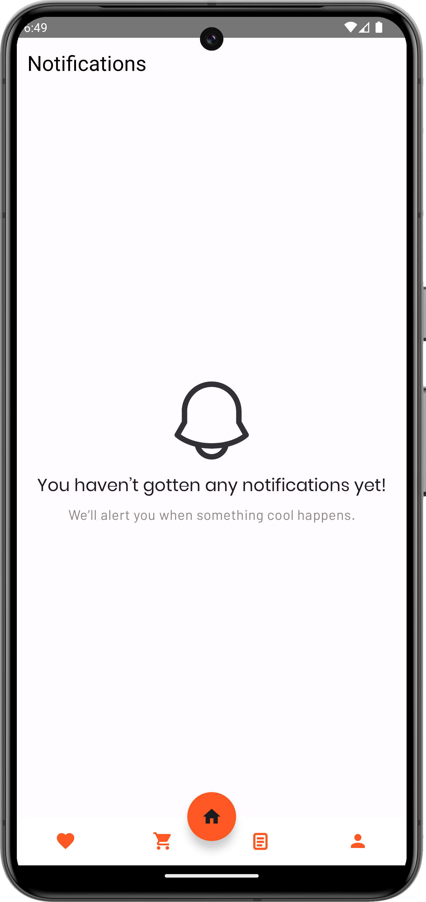    |
|:----------------------------------------------------------------------:|:----------------------------------------------------------------------:|:----------------------------------------------------------------------:|
| **CART PAGE**                                                          |   **SEARCH PAGE**                                                      |      **NOTIFICATIONS PAGE**                                            |

| 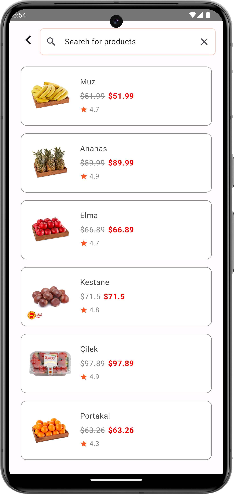        | 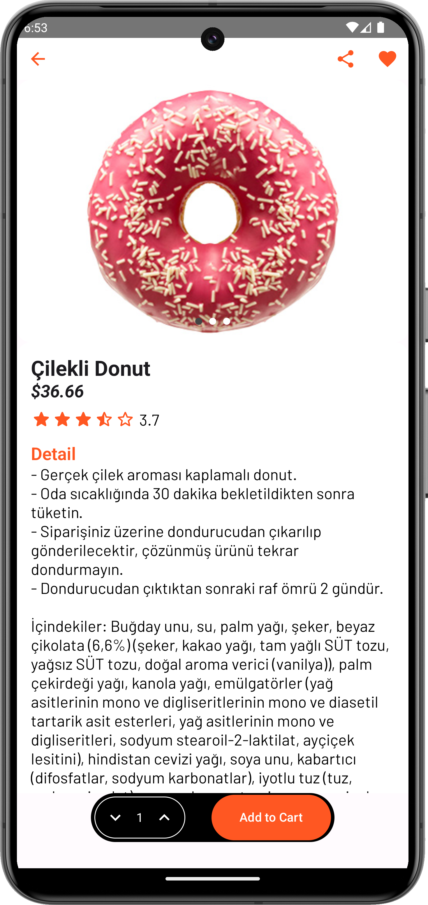          | 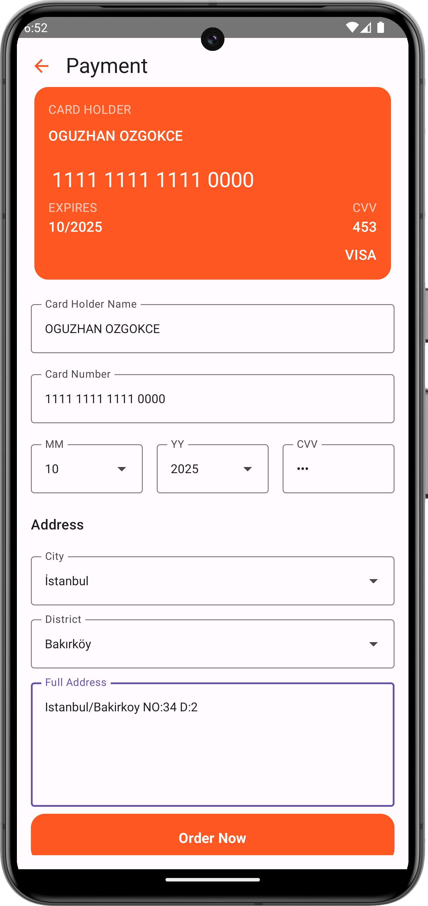         |
|:----------------------------------------------------------------------:|:----------------------------------------------------------------------:|:----------------------------------------------------------------------:|
| **CATEGORY PAGE**                                                      |   **DETAIL PAGE**                                                      |       **PAYMENT PAGE**                                                 |

##
